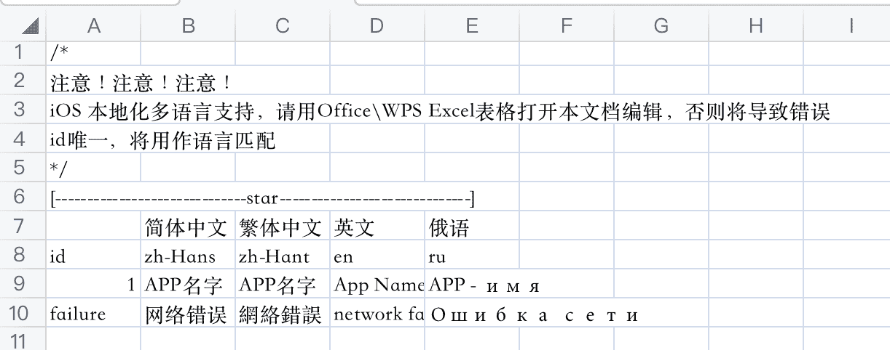

# RZLocalizedString
iOS 本地化多语言的一种简便实现方法，通过Excel来配置创建多语言列表

 <p style="center">  </p>

### 使用方法
1. 下载demo
拷贝`RZLocalizedString.swift` `RZLocalizedString.txt`到项目中

2. 通过id设置文本
```Swift
let text = RZLocalizedString.string(for: "failure")
```

3. 通过id，以及指定语言获取文本
```Swift
let text = RZLocalizedString.string(for: "failure", language: "en")
```
4. 跟随系统
```Swift
RZLocalizedString.shared.followSystem = true
```

5. 自定义首选显示列表
```Swift
RZLocalizedString.shared.customLanguages = ["en"]
```

### 解释配置语言
1. 将txt文档拖入Office\WPS Excel。
在 
```
[------------------------------star------------------------------]
```
之后的第一行是中文备注语种，无效文本，会被舍弃

2. 第一列为”id“, 实际使用过程中，通过id查找对应的语言文本行
3. 后边每一列代表对应语言的文本
